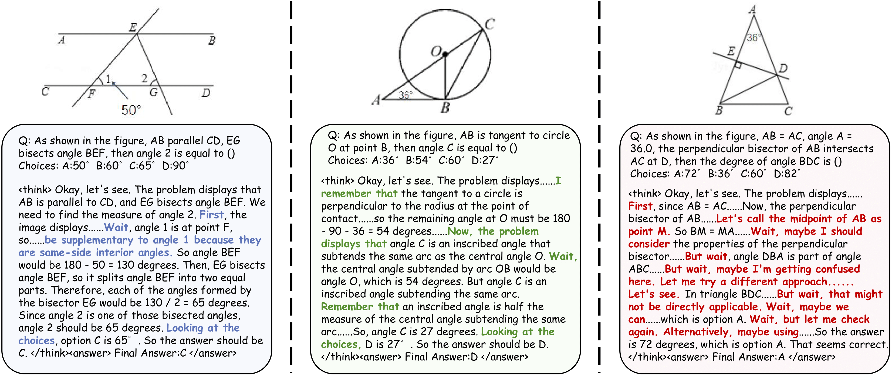
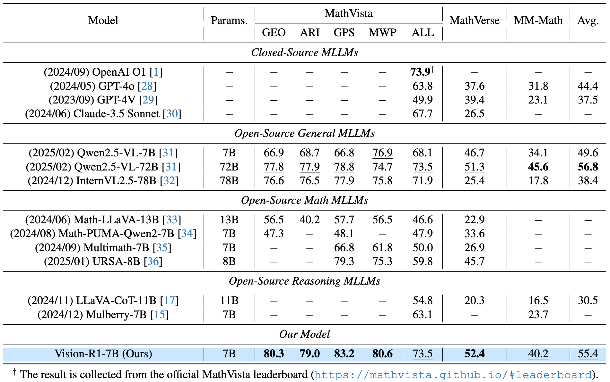
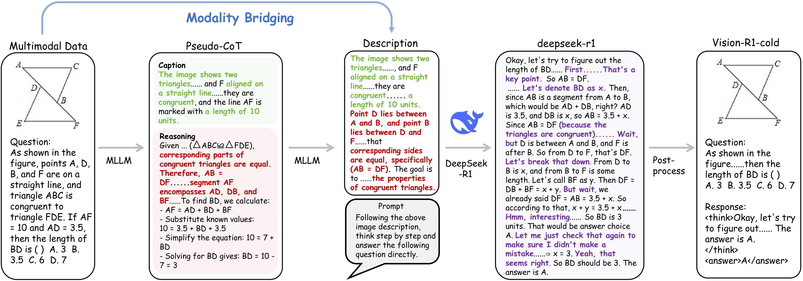

# Vision-R1

The official repo for "Vision-R1: Incentivizing Reasoning Capability in Multimodal Large Language Models". (<a href="https://github.com/Osilly/Vision-R1/blob/main/Vision-R1.pdf">[Vision-R1 Paper]</a>)

The datasets and code will be released, stay tuned!

## Our Exploration

> **Left panel:** Our Vision-R1 Pipeline. We first use the existing MLLM and DeepSeek-R1 to obtain a high-quantity Multimodal CoT dataset, which is used as the cold-start initialization data for the base MLLM to obtain the post-cold-start Vision-R1-CI, and then we perform the RL training on Vision-R1-CI to obtain the reasoning MLLM, Vision-R1.
> 
> **Right panel:** We observe that directly applying RL to MLLMs fails to effectively incentivize  strong reasoning capability (see (C) and (D)).  Vision-R1-Zero, trained via RL without prior initialization, struggles to generalize from limited data (see (E), (F), notably, Vision-R1-Zero was applied in format reward function). Vision-R1-CI faces the Overthinking Optimization Problem, favoring shorter CoT reasoning, where correct reasoning processes mostly focus on the shorter CoT reasoning sequences (see (A)). During subsequent RL training, we observe a lengthening of reasoning steps but a decline in performance (see (D) and (E)), making optimization particularly challenging. For Vision-R1, it initially shortens CoT to refine the right thought process under RL training. PTST enables Vision-R1 to progressively acquire a more complex reasoning process (see (C), (D), and (E)) to improve the performance, such that our Vision-R1 with 7B parameters achieves comparable performance to the strongest MLLMs with 70B+ parameters (see (B)). Note that Vision-R1 used various colored lines to indicate the different stages in PTST.

## Vision-R1 Reasoning Example

> The output examples of Vision-R1-7B on MathVerse benchmark. Vision-R1-7B shows ''human-like'' questioning and self-reflective thought process when solving math reasoning problems, which is also called **''Aha moment''** in DeepSeek-R1's paper.

## Result

## Pipeline

### Cold-start Initialization Data Preparation 

> The overall data generation pipeline incorporating our Modality Bridging method. The multimodal data is first sent to MLLMs to obtain a "Pseudo-CoT'' consisting of a caption and reasoning process, which serves as the input of MLLMs along with the original image-question pair to produce detailed descriptions. Through this modality bridging approach, the textual descriptions provide DeepSeek-R1 with holistic information that facilitates the generation of high-quality CoT processes, which are post-processed and integrated with the original data to create the final Vision-R1-cold dataset.

### RL Training

> GRPO with our proposed PTST strategy.  We progressively loosen the context length restrictions, increasing the length of reasoning process. Specifically, we set the reasoning length to 4K, 8K and 16K tokens for each stage, with corresponding group numbers of 16, 8 and 4 respectively. The reward function for GRPO is based on a hard formatting result reward function (HFRRF). The dotted line in the ``Stage 3'' indicates that the final version of Vision-R1 did not undergo the third stage of training.
